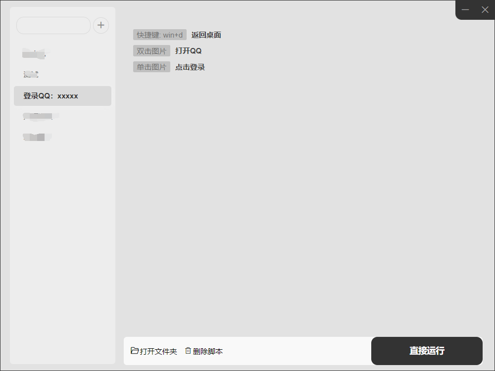
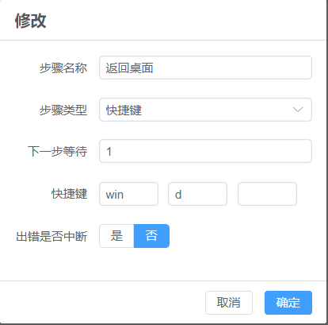
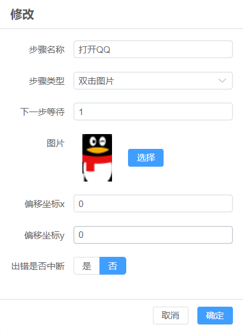
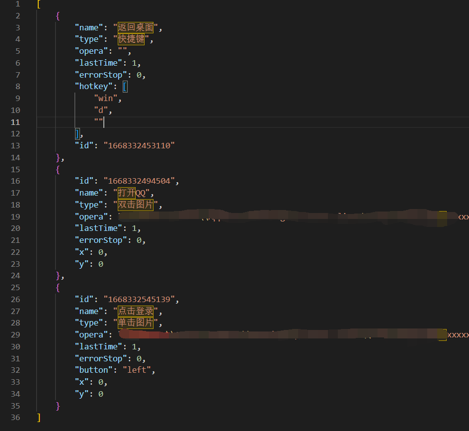

### 一个用于windows的自动化工具

> 仅用于学习交流

#### 使用技术、库、插件等

- electron
- element-plus
- vue3
- pinia
- typescript
- vite3
- pyautogui

#### 基础原理

利用pyautogui提供的操作键盘、鼠标API，
通过json文件描述步骤信息，
再通过electron+vue做步骤的图形化操作处理，
最后生成对应的python脚本和步骤json文件。

#### 图示

